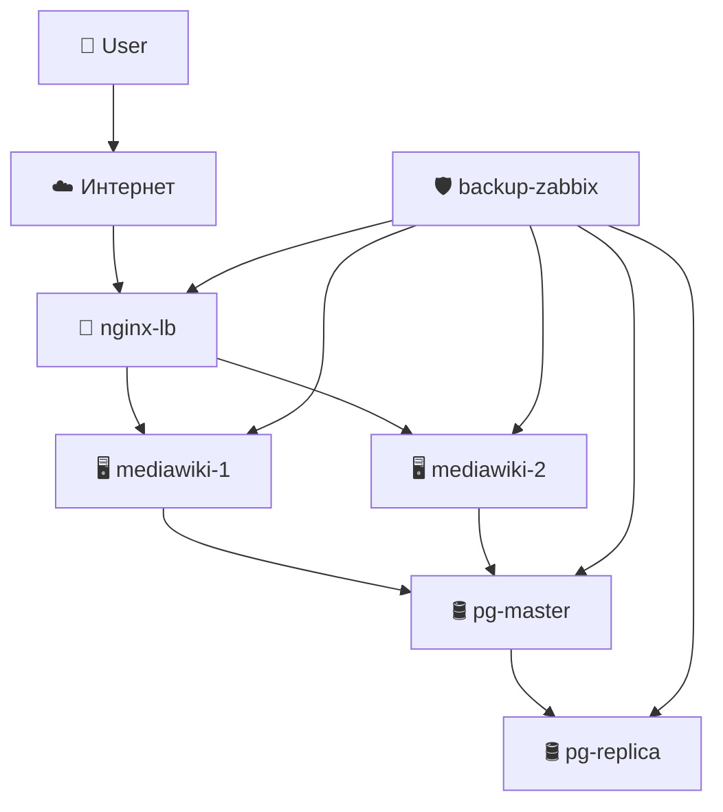

# 📘 Развёртывание корпоративной вики-системы на базе MediaWiki

---

## 📌 Цель проекта

Развернуть и настроить инфраструктуру для корпоративного сервиса ведения документации с помощью MediaWiki, с обеспечением:

- отказоустойчивости (2 MediaWiki, балансировщик)
- мониторинга (Zabbix)
- резервного копирования (fs + БД)
- отказоустойчивой базы данных (PostgreSQL master/replica)

---

## 🗺️ Инфраструктура

| Компонент        | Назначение                                       |
|------------------|--------------------------------------------------|
| `nginx-lb`       | Балансировщик между двумя MediaWiki              |
| `mediawiki-1/2`  | Два экземпляра MediaWiki                         |
| `pg-master`      | Главный сервер PostgreSQL                        |
| `pg-replica`     | Реплика PostgreSQL (streaming replication)       |
| `backup-zabbix`  | Мониторинг Zabbix + резервное копирование        |

---

## 🧰 Используемые технологии

- **Terraform** — создание виртуальных машин в Yandex.Cloud
- **Ansible** — настройка всех компонентов
- **PostgreSQL** — СУБД для MediaWiki и Zabbix
- **MediaWiki** — веб-приложение для ведения документации
- **Zabbix** — система мониторинга
- **cron + shell** — резервное копирование

---

## 🚀 Шаги запуска

### 1. Поднять инфраструктуру в Яндекс.Облаке

```bash
cd Terraform
terraform init
terraform apply -var-file=terraform.tfvars
```

### 2. Подставить IP-адреса в `ansible/inventory.yaml`

Из `terraform output` → `external_ips`.

### 3. Настроить SSH-доступ в `group_vars/all.yml`

```yaml
ansible_user: ubuntu
ansible_ssh_private_key_file: ~/.ssh/minio
ansible_ssh_common_args: '-o StrictHostKeyChecking=no'
ansible_become: true
```

### 4. Выполнить настройку всех компонентов

```bash
cd ansible
ansible-playbook site.yml
```

---

## 💾 Резервное копирование

На машине `backup-zabbix` размещаются:

- `/usr/local/bin/backup_fs.sh` — создаёт архив `/var/www/html`
- `/usr/local/bin/backup_db.sh` — создаёт дамп БД `my_wiki` через `pg_dump`
- cron-задачи запускаются ежедневно в 03:00
- Бэкапы хранятся в `/opt/backups/files/` и `/opt/backups/db/`

---

## 📈 Мониторинг (Zabbix)

- Zabbix поднимается вместе с PostgreSQL и Apache (всё кодом, без ручной настройки).

- Ansible загружает схему в БД, кладёт конфиги (zabbix_server.conf, zabbix.conf.php).

- Веб-интерфейс сразу доступен на http://<ip_backup>/zabbix.

- Авторизация: Admin / zabbix.

- Автоматически через API создаётся:

  - hostgroup MediaWiki

  - хост nginx-lb (с агентом и web scenario)

  - web scenario проверки / MediaWiki

  - шаблон Linux by Zabbix agent

- триггеры:

  - HTTP code != 200 (CRIT)

  - Response time > 2000 ms (WARN, avg 5m)

  - Response time > 5000 ms (CRIT, avg 5m)

✨ Можно расширять правила — через Ansible-шаблоны добавлять новые web-scenario и триггеры.

👉 Можно добавить хосты вручную в интерфейсе, привязать шаблон `Template App HTTP Service`.


---

## 🔁 Репликация PostgreSQL

- Используется `pg_basebackup` и `standby.signal`
- Реплика получает изменения в режиме `hot standby`
- Проверка на мастере:

```bash
sudo -u postgres psql -c "SELECT * FROM pg_stat_replication;"
```

- Проверка на реплике:

```bash
sudo -u postgres psql -c "SELECT pg_is_in_recovery();"
```

---

## ✅ Проверка отказоустойчивости

| Сценарий                               | Ожидаемое поведение                            |
|----------------------------------------|-------------------------------------------------|
| Выключение `mediawiki-1`               | Nginx продолжает работать с `mediawiki-2`      |
| Выключение `pg-master`                 | `pg-replica` готов к переключению              |
| Удаление контента MediaWiki            | Восстанавливается из `tar`-архива              |
| Удаление базы данных                   | Восстанавливается из `pg_dump`                 |

---

## 📦 Структура проекта

```text
Terraform/
├── main.tf
├── variables.tf
├── terraform.tfvars
├── providers.tf
├── outputs.tf
├── versions.tf

ansible/
├── inventory.yaml
├── ansible.cfg
├── group_vars/
│   └── all.yml
├── site.yml
├── roles/
│   ├── nginx/
│   │   ├── tasks/main.yml
│   │   └── handlers/main.yml
│   ├── mediawiki/
│   │   ├── tasks/main.yml
│   │   ├── handlers/main.yml
│   │   └── templates/apache-vhost.j2
│   ├── postgres/
│   │   ├── tasks/main.yml
│   │   └── handlers/main.yml
│   ├── zabbix/
│   │   ├── tasks/main.yml
│   │   ├── handlers/main.yml
│   │   └── templates/
│   │       ├── backup_fs.sh.j2
│   │       └── backup_db.sh.j2
│   └── common/
│       ├── tasks/main.yml   (установка zabbix-agent)
│       └── handlers/main.yml

```

---
## 📦 Схема проекта



---

## 🏁 Заключение

- Проект автоматизирует полноценную инфраструктуру для MediaWiki
- Реализованы все элементы: отказоустойчивость, мониторинг, бэкап
- Всё готово к демонстрации и реальному использованию

## Разработчики

**Алексей Потанин**   [avpotanin@gmail.com](mailto:avpotanin@gmail.com)
GitHub: [https://github.com/potashka](https://github.com/potashka)